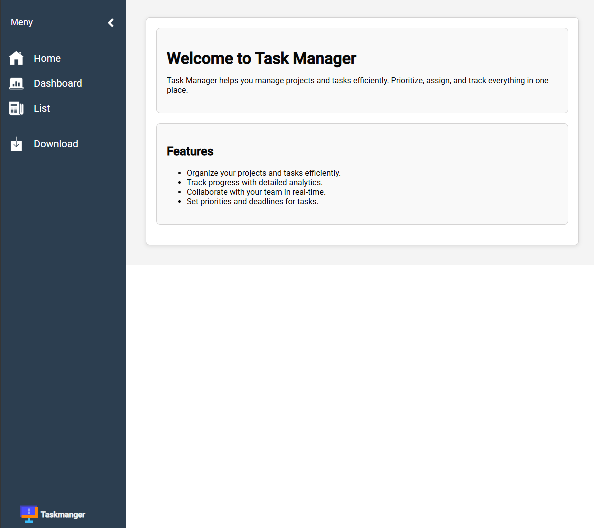
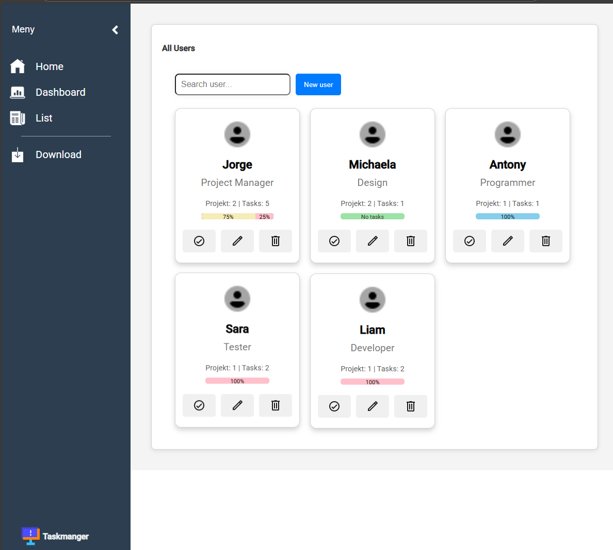
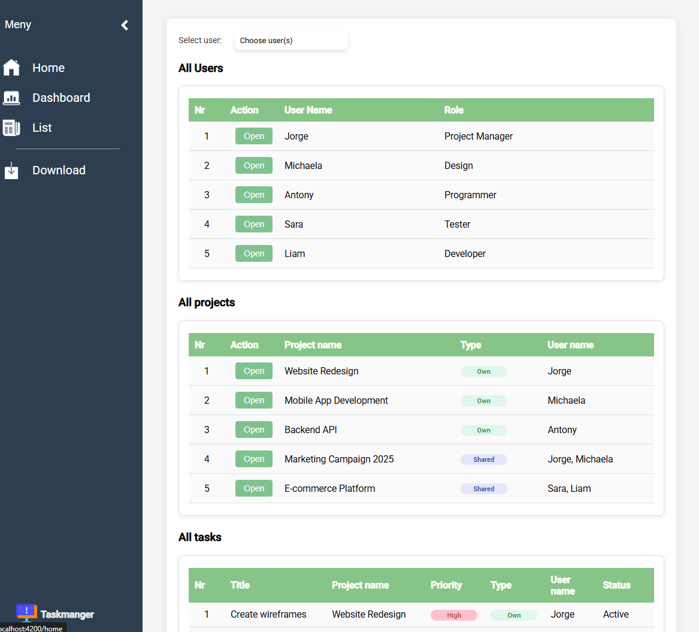
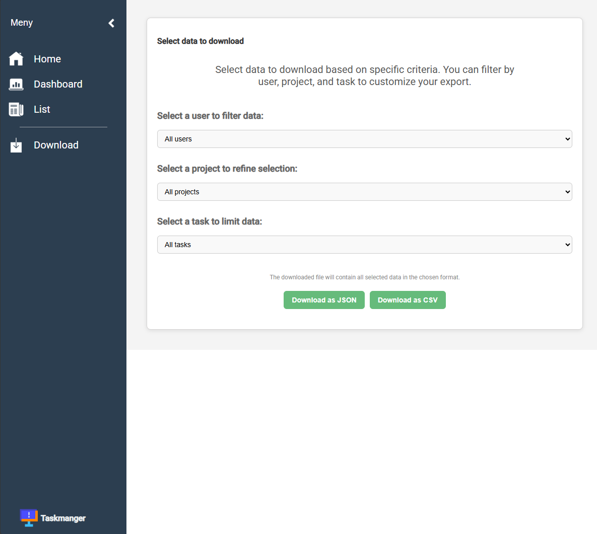

<h1 align='center'>Task Manager</h1>

<p align="center">En uppgiftshanterare byggd i Angular (TypeScript) med SCSS för styling. Projektet använder en mock-API (JSON-server) för att hantera data, men allt startas automatiskt med ett kommando.</p>

---

## Funktioner

- ✨ Skapa nya uppgifter
- ✅ Markera uppgifter som klara
- 🗑️ Ta bort uppgifter
- 📋 Lista alla uppgifter

---

## Teknologier

### Frontend

- Angular – ramverk för webbaserade applikationer
- TypeScript – typat språk ovanpå JavaScript
- HTML5 – struktur för användargränssnittet
- SCSS (Sass) – CSS-preprocessor för styling
- RxJS – hantering av asynkrona operationer
- Angular CLI – verktyg för utveckling, test och bygg

### Backend (mock)

- JSON-server – simulerar en REST API-backend
- Node.js – körmiljö för JavaScript/TypeScript
- npm – pakethanterare för scripts och beroenden
- concurrently – kör frontend och backend parallellt

### Övrigt

- Git & GitHub – versionshantering
- Visual Studio Code – utvecklingsmiljö

---

## Arkitektur

Projektet består av:
- Frontend (Angular)
  - Startas med ng serve
  - Körs på http://localhost:4200

- Backend (mock-API via JSON-server)
  - Startas med npm run start:api
  - Körs på http://localhost:3000

- Utveckling
  - npm start kör båda parallellt (via concurrently)

---

##  Projektstruktur

```
taskmanager/
├── mock-api/              # JSON-server med db.json (mock-backend)
│   └── db.json            # Datafil för uppgifter
├── src/                   # Angular-källkod
│   ├── app/               # Huvudlogik och komponenter
│   ├── assets/            # Bilder, ikoner, etc.
│   ├── environments/      # Miljöfiler (dev/prod)
│   └── index.html         # Rot-HTML-fil
├── angular.json           # Angular-konfiguration
├── package.json           # Projektets beroenden & scripts
├── tsconfig.json          # TypeScript-konfiguration
└── README.md              # Dokumentation
```

---

## Installation

1. Klona repot:
```
git clone https://github.com/Jojje84/taskmanager.git
cd taskmanager
```

1. Installera beroenden:
```
npm install
```

1. Starta applikationen (frontend + mock-API):
```
npm start
```

1. Öppna i webbläsaren:
 - Frontend: http://localhost:4200
 - Mock-API: http://localhost:5000

---

## Användning

- Lägg till nya uppgifter i formuläret
- Se och hantera dem i listan
- Data sparas via mock-API:t

---

## Skärmbilder

- Home-sida



- Dashboard-sida



- List-sida


- Download-sida


---

## Kontakt

👤 Jorge

- GitHub: [Jojje84](https://github.com/Jojje84)
- E-post: [jorgeavilas@icloud.com](mailto:jorgeavilas@icloud.com)
