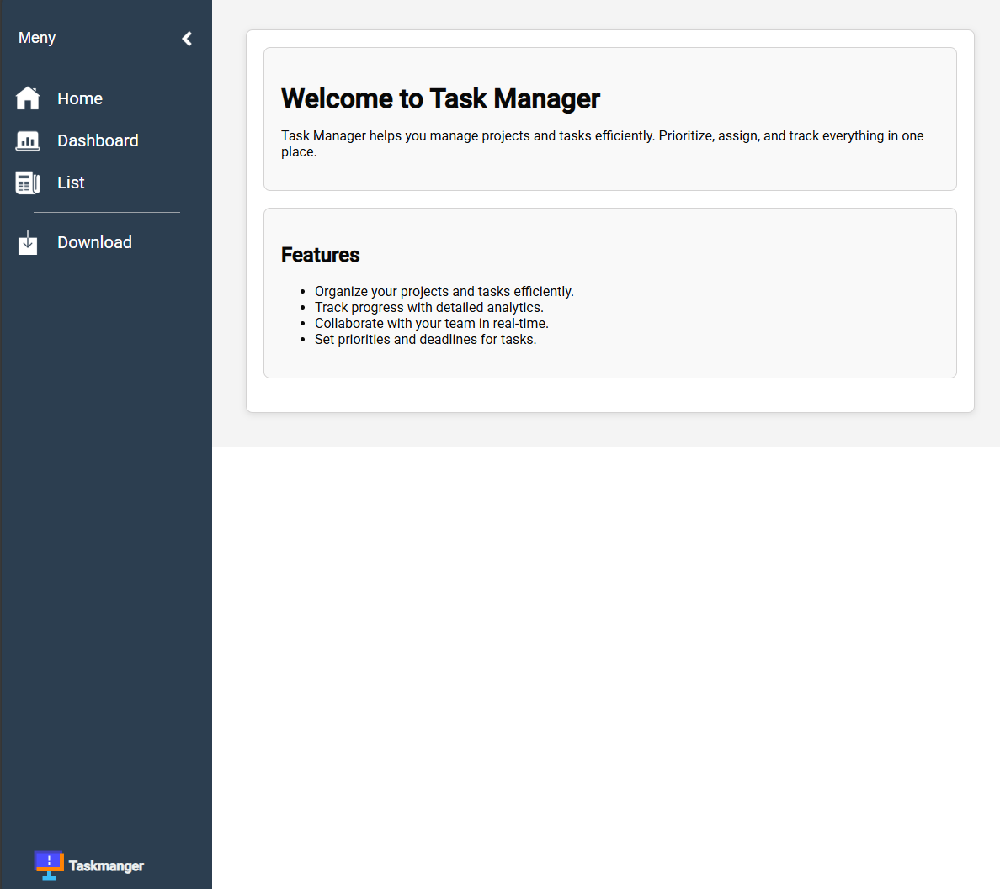
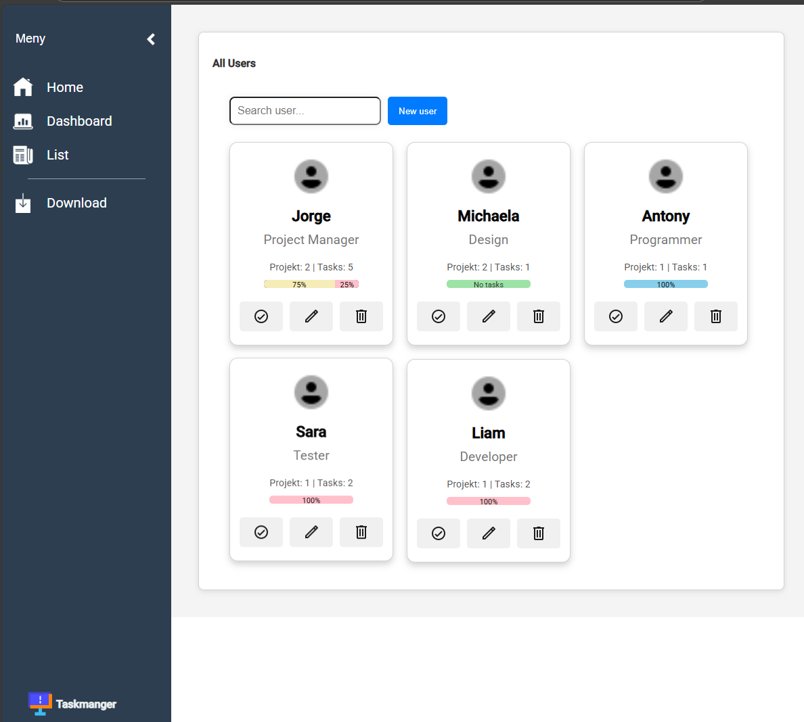
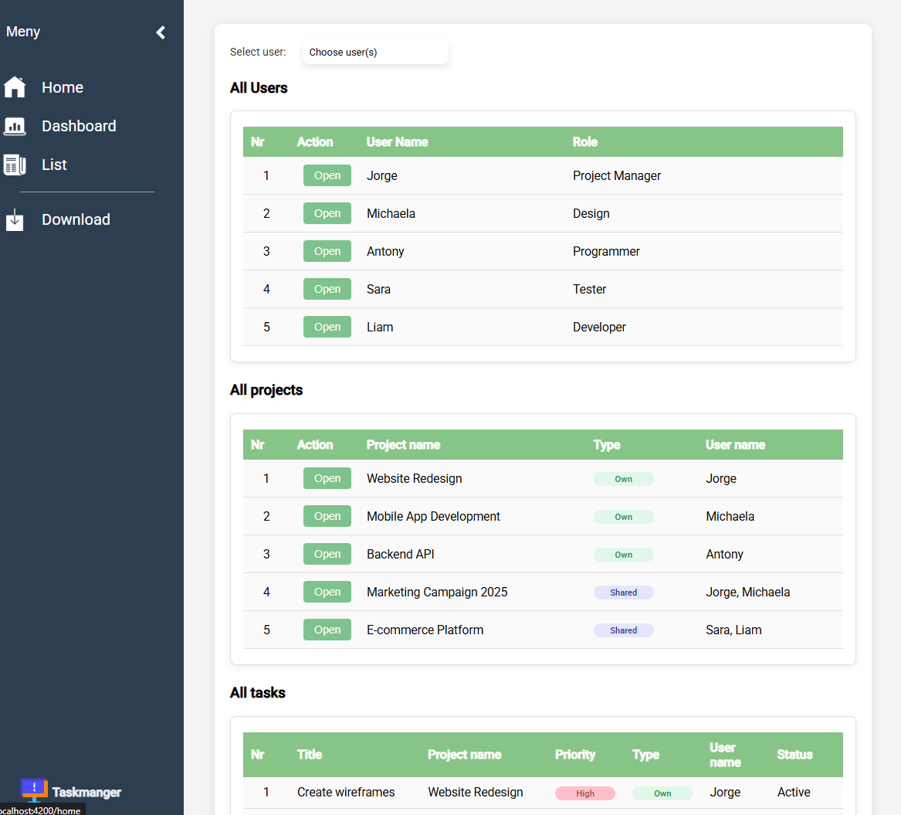
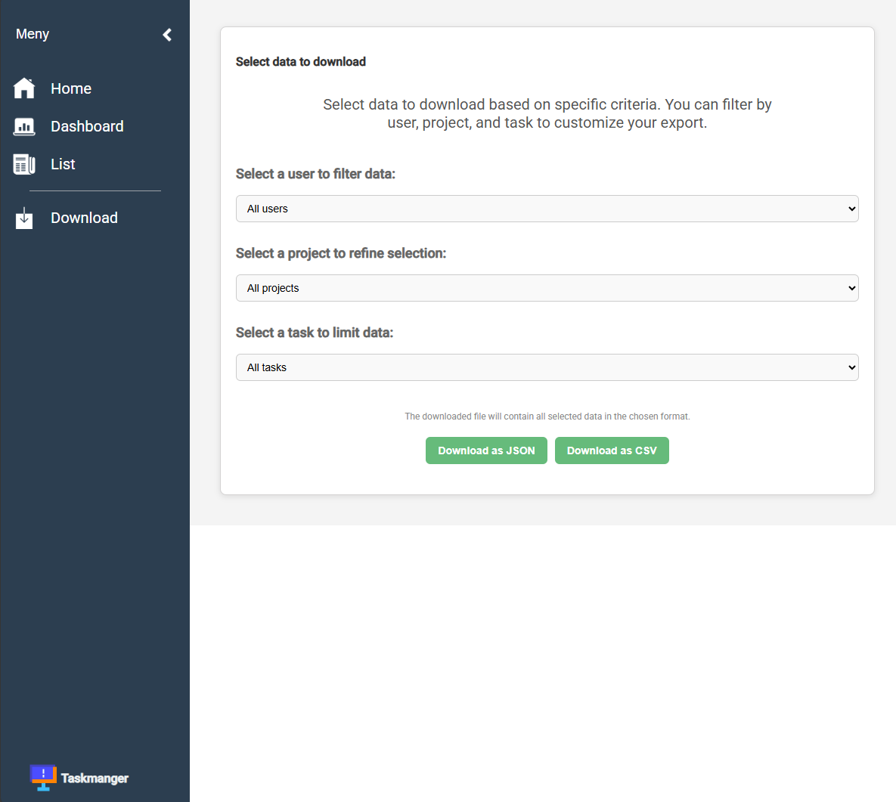

<h1 align='center'>Task Manager</h1>

<p align="center">En uppgiftshanterare byggd i Angular (TypeScript) med SCSS för styling. Projektet använder en mock-API (JSON-server) för att hantera data, men allt startas automatiskt med ett kommando.</p>

---

## Funktioner

- ✨ Skapa nya uppgifter
- ✅ Markera uppgifter som klara
- 🗑️ Ta bort uppgifter
- 📋 Lista alla uppgifter

## Teknologier

### Frontend

- Angular – ramverk för webbaserade applikationer
- TypeScript – typat språk ovanpå JavaScript
- HTML5 – struktur för användargränssnittet
- SCSS (Sass) – CSS-preprocessor för styling
- RxJS – hantering av asynkrona operationer
- Angular CLI – verktyg för utveckling, test och bygg

### Backend (mock)

- JSON-server – simulerar en REST API-backend
- Node.js – körmiljö för JavaScript/TypeScript
- npm – pakethanterare för scripts och beroenden

### Övrigt

- Git & GitHub – versionshantering
- Visual Studio Code – utvecklingsmiljö

---

## Arkitektur

Projektet består av:
- Frontend (Angular)

Körs på http://localhost:4200

Hanterar användargränssnittet

- Backend (mock-API via JSON-server)

Körs parallellt på http://localhost:5000

Startas automatiskt via npm start

Frontend kommunicerar med backend genom HTTP-anrop.

## Installation

Klona repot:
```
git clone https://github.com/Jojje84/taskmanager.git
cd taskmanager
```

Installera beroenden:
```
npm install
```

Starta applikationen (frontend + mock-API):
```
npm start
```

Öppna i webbläsaren:

Frontend: http://localhost:4200

Mock-API: http://localhost:5000

---

## Användning

Lägg till nya uppgifter i formuläret

Se och hantera dem i listan

Data sparas via mock-API:t

---

## Skärmbilder







## Kontakt

👤 Jorge

GitHub: Jojje84


